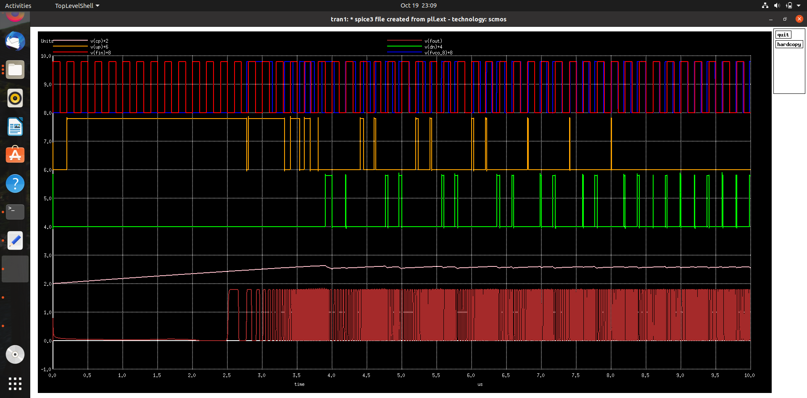

# VDSOpen21 On Chip PLL Workshop

This is the report for the One Day Workshop on "On Chip PLL using OSU 180nm Process Node"

# Contents
- [Open Source Tools Used](#Open-Source-Tools-Used)
- [Pre Layout Schematic and Simulations](#Pre-Layout-Schematic-and-Simulations)
- [Layout Design Using Magic](#Layout-Design-Using-Magic)
- [Post Layout Simulations](#Post-Layout-Simulations)
- [Author](#Author)
- [Acknowledgements](#Acknowledgements)

# Open-Source-Tools-Used

- eSim 
    - https://esim.fossee.in/home

- Ngspice
    - http://ngspice.sourceforge.net/

- Magic
    - http://opencircuitdesign.com/magic/
    

# Pre Layout Schematic and Simulations
- Schematic was done using eSim
 Basic gate schematics
 - Inverter

 - 4 Input NAND Gate

The Netlist were obtained from the tool and were modified to make it run in Ngspice
- Basic gate plots
 - Inverter

 - 3 Input NAND Gate

- Prelayout Simulation PLL main blocks
	- Phase Detector
	
	- Phase Detector with Charge Pump
	
	- Volage Controlled Oscillator
	
	
- Phase Locked Loop

# Layout Design Using Magic
 - PLL
 
 

# Post Layout Simulations
 

# Author
- R.V.Rohinth Ram

# Acknowledgements
- Paras Gidd, M.Tech.( Microelectronics ), Manipal Institute of Technology,(MAHE), parasgidd@gmail.com
- Kunal Ghosh, Co-founder, VLSI System Design (VSD) Corp. Pvt. Ltd. - kunalpghosh@gmail.com

---
 * Thanks to Paras Gidd, Workshop Instructor
 * Reference https://github.com/parasgidd/avsdpll_3v3
---

